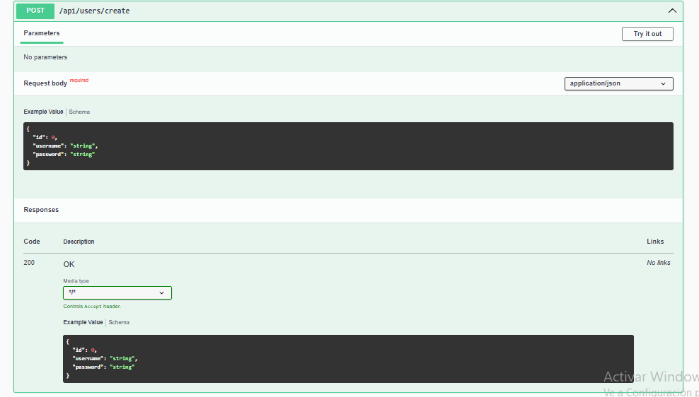
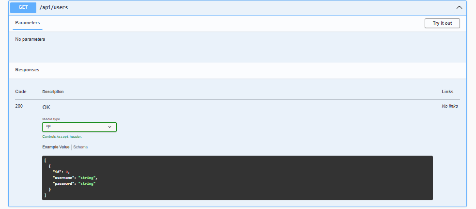
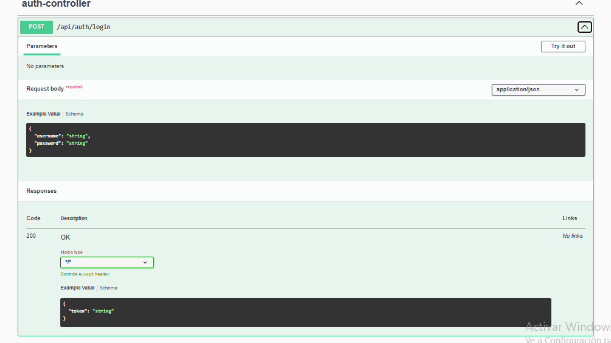
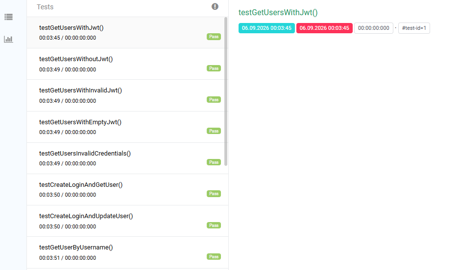
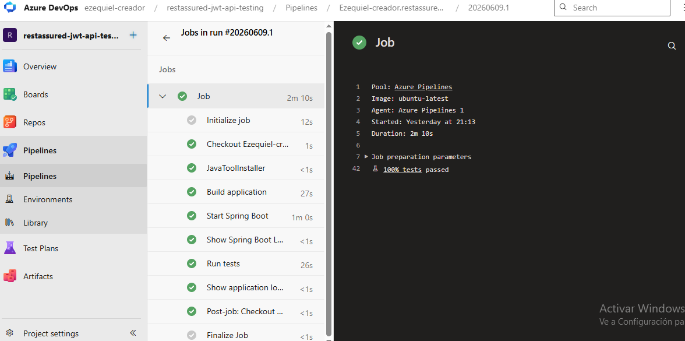

# REST Assured JWT API Testing

Proyecto de automatización de pruebas API desarrollado con Java, Spring Boot y Rest Assured.

## Technologies

- Java 21
- Spring Boot 3.3.5
- Spring Security
- JWT
- Rest Assured
- JUnit 5
- Swagger
- Extent Reports
- Azure DevOps
- Maven

## Features

- JWT Authentication
- User CRUD
- API Testing
- Swagger Documentation
- CI/CD Pipeline

## Run Application

```bash
mvn spring-boot:run

## Swagger Documentation





## Extent Report



## Azure DevOps Pipeline

